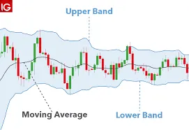
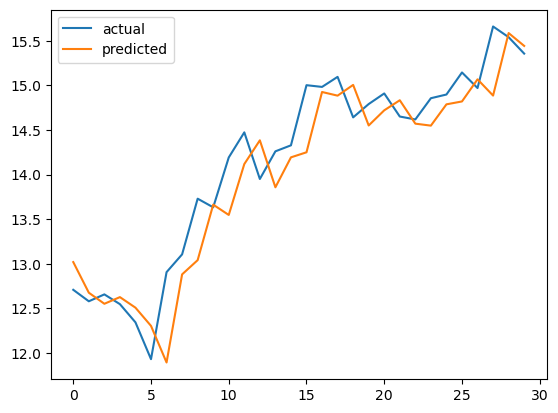

<h1>STOCK CHART PREDICTION</h1>

# Stock Prediction Project

This project aims to predict stock prices using Deep learning techniques. The primary goal is to provide insights into potential future price movements based on historical data. However the model that i have build is a lagging model

Leading models: The ability to provide guiding insights to how a price would change before it occurs.

Lagging models: Models that react to a price change only after it has occurred.

In stock analysis, we need to focus our efforts on identifying leading models that is able to foretell the price position accurately.

## Table of Contents
- [Overview](#overview)
- [Features](#features)
- [Setup](#setup)
- [Usage](#usage)
- [Results](#results)


## Overview

Stock prediction is a challenging task that involves the use of various techniques ranging from statistical models to machine learning algorithms. This project leverages [LSTM (Long Short-Term Memory)](https://en.wikipedia.org/wiki/Long_short-term_memory) networks to predict future stock prices based on historical data.
In this model i have used Adj close, EMA and Bollinger BANDS indicator data as my features.

Exponential moving average (EMA)

The EMA is a moving average which places greater weight on recent prices than ones that are further away from the current time period. This helps to reduce the amount of lag and allows for faster reaction to change in prices.

Bollinger bands



A Bollinger band defines 2 lines that are set 2 deviations apart from the time series’s simple moving average. It sets a constraint on the possibility of the next day’s price as most of the price action happens within this area. The closer the bands, the more volatile the price movement and hence the more likely a current trend may be ending or even reversing.

## Features

- **Data Preprocessing**: Cleansing and preparing historical stock data.
- **Model Training**: Training the LSTM model using TensorFlow/Keras.
- **Evaluation**: Evaluating the model's performance using various metrics.
- **Visualization**: Visualizing the original vs. predicted stock prices.

## Setup

To run this project locally, follow these steps:

Step1: First clone the repository using
```sh
git clone https://github.com/harshayr/STOCK-PREDICTION.git
```

Step2: go into current working directory 
```sh
cd STOCK_PREDICTION
```

Step3: Install prerequisites by pasting below command to your terminal
```sh
pip install -r requirment.txt
```

Step4: Run streamlit file using terminal or command promt
```sh
streamlit run main.py
```

## Usage

1. Run the data preprocessing scripts to prepare the data.
2. Train the LSTM model using the provided scripts.
3. Evaluate the model's performance and visualize the results.

## Results

The project has achieved 200.094 MSE on the test and train dataset, showcasing its effectiveness in predicting stock prices for 30 days.




